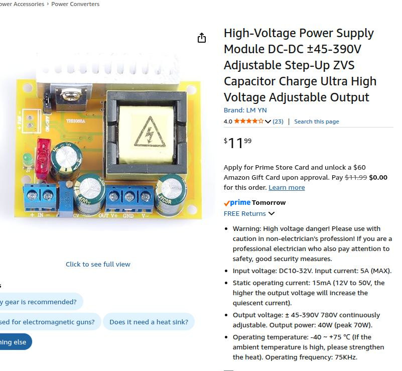

# smart-glass-driver

This is a line-powered programmable function generator capable
of generating an output of about 140V pk-pk on each of two outputs
(which can be out of phase).

Here are the specs from Darren:

1.  Provide amplitude up to about 60-70Vpp AC (note: not 60 VAC RMS),
    we need to be able to change the amplitude for testing, with
    likely voltages 20, 30, 40, 50, 60 VppAC
2.  We also need to be able to alter the AC frequency, from low Hz to
    up to at least 1 kHz.
3.  We need to be able to have control over the output, with the
    ability to modulate (binary turn on and off) the output signal
    from a few Hz to up to about 300Hz. We would use this for
    lock-in. I envision control with a digital I/O pin.

For 1kHz sine wave with ~16 samples per cycle, the sampling rate would
be 62.5us or for 8 samples 125us.  

We need to stop Timer0 to avoid the interrupts.  Use TimerOne library
to interrupt at 62us and take values from a table.  This seems to
work just fine.  **But** we need to do two channels
out of phase on two DACs.  Simulate this with Set1 and Set2 functions.

The slew rate of the LTC6090 is spec'd at 21V/us.  So for 120V this
would be about 6uS or a minimum cycle time of 12uS 80kHz so no problem
reproducing a 1kHz output.  This is well matched to the 5us slew of
the DAC.

## 2026-04-02

ECOs for "Eric's" board:

*  Solder a wire between pins 1 and 6 of U1 (best done on the bottom side)
This connects DAC reference to 5V
*  Solder a wire between J4 pin 3 and J2 pin 5
*  Solder a wire between J4 pin 4 and J2 pin 7.
This connects the SPI data and clock to the right Arduino pins


## 2026-04-01

Ordered parts to assemble a system based on a transformer-based zener supply
and two InTENS shield boards.

Investigating the MCP492x DAC using the BE511 shield board.
<br>DAC setting code for first test:

```
    // Write a word to DAC channel 0 only
    // Unbuffered mode so no need to manipulate LDAC
    void MCP4922::Set1( int A) {
      int channelA = A | 0b0011000000000000; // unbuffered mode, gain = 2X
      SPI.beginTransaction(SPISettings(MCP_CLOCK, MSBFIRST, SPI_MODE0));
      digitalWrite(_CS, LOW);
      SPI.transfer(highByte(channelA));
      SPI.transfer(lowByte(channelA));
      digitalWrite(_CS, HIGH);
      SPI.endTransaction();
    }
```

On an Uno R3 with SPI clk set to 8MHz this takes 17us (plus any timer
interrupt delay).  Also the DAC takes 5us to slew full scale (roughly
linear).

**Software Written**: sketch `DAC_Function_Gen` accepts integer rates
from 25-2000 Hz (more or less, up to 1kHz best).  Serial at 9600.

## 2026-03-31

### Testing the commercial setup

Made some measurements of the commercial driver with Weizhe.
General observations:

* Drive electronics supplied provides about 200V pk-pk AC
two-phase at 60Hz.  Not quite sinusoidal.
* Tested with 4.7k resistor in series.  Current waveform
is roughly in phase with voltage.  Amplitude is about 2mA (absolute value).

### Testing Amazon HV supply

Now testing an HV supply I found in the box with the InTENS stuff.



It claims to deliver up to 40W or 15mA.  

* Test with 47k load.  Get a pretty nasty ripple of 20V @ 10Hz.
* Test with 22k load.  Just as bad.

Probably not worth considering using this thing.

### Considering home-made supply

We could build a nice +/-65V supply using a Triad N-68X transformer,
bridge rectifier and an RC filter with zener regulator.

